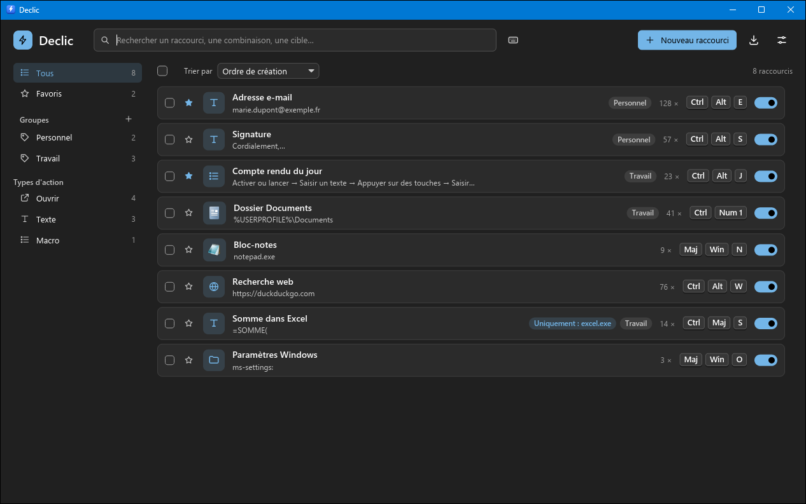
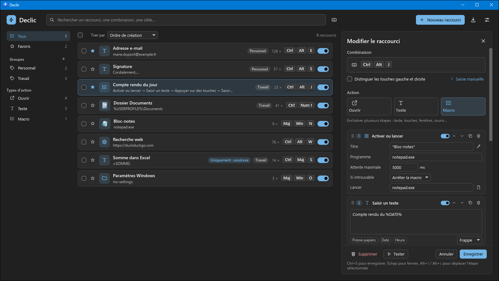
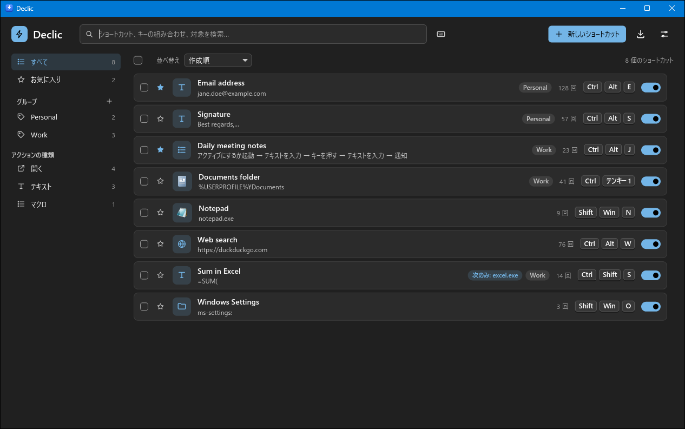
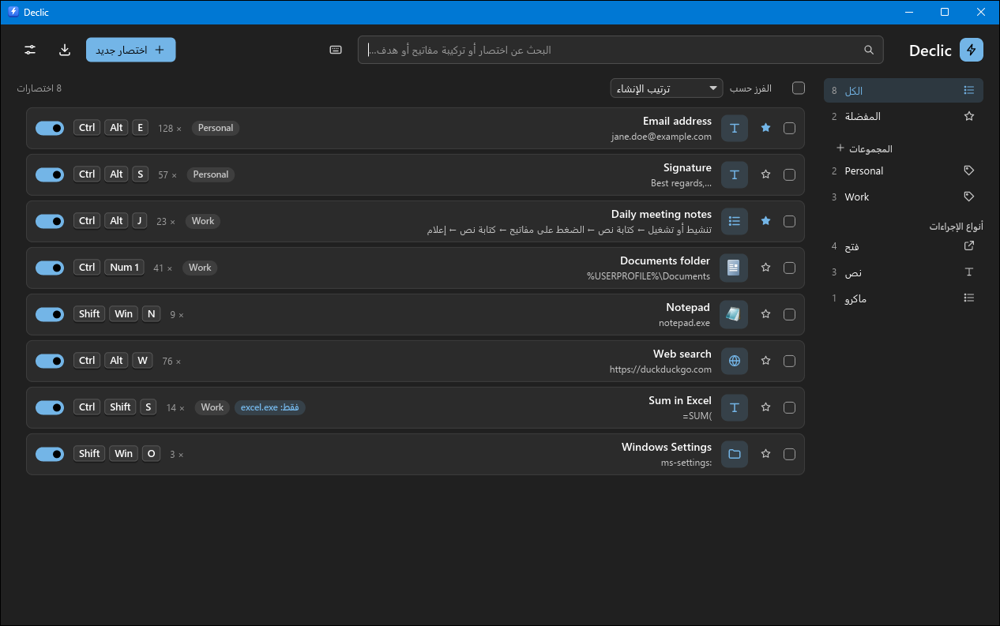

# Declic

**Vos raccourcis clavier, en un déclic.**

[English](README.md) · **Français**



Declic est un utilitaire de raccourcis clavier pour Windows 10 et 11. Il permet
d'associer une **combinaison de touches** à une **action** :

- **Ouvrir** un programme, un document, un dossier, un site web, une adresse
  `mailto:` ou un emplacement de Windows (`ms-settings:…`) ;
- **Texte** : saisir un texte (adresse e-mail, signature, formule…) dans la
  fenêtre active, frappé ou collé ;
- **Macro** : enchaîner des étapes (texte, touches, attentes, activation de
  fenêtres, clics et mouvements de souris, notifications…).

Declic tourne discrètement dans la zone de notification. Il est écrit en Rust,
avec l'interface graphique [iced](https://iced.rs), et disponible en 31 langues
(voir [Langues](#langues)).

> Cette version est la **V1** décrite au § 13 du cahier des charges
> ([`docs/functional-specification.md`](docs/functional-specification.md), en
> anglais) : le MVP, plus les macros, les groupes, l'import/export et les
> fonctions de confort.

## Télécharger

Téléchargez la dernière version sur la page
**[Releases](https://github.com/florent3108/Declic/releases/latest)** :
décompressez le zip, puis lancez `declic.exe`. Aucune installation ni droits
administrateur ne sont nécessaires.

> L'exécutable n'est pas encore signé numériquement : au premier lancement,
> Windows peut afficher « Windows a protégé votre ordinateur ». Cliquez sur
> **Informations complémentaires**, puis **Exécuter quand même**.



## Fonctionnalités

### Combinaisons et conditions

- Toute touche (lettres, chiffres, ponctuation, F1–F24, pavé numérique
  distinct des chiffres du haut, touches multimédia, navigateur et de
  lancement…), modificateurs Ctrl, Alt, Maj, Win, avec distinction
  gauche/droite en option.
- Saisie de la combinaison **par capture** (les raccourcis existants et les
  combinaisons de Windows comme Win+E sont suspendus pendant la saisie ;
  Échap seule annule) ou **manuelle** (modificateurs + liste de touches avec
  recherche).
- Conditions : *partout*, *uniquement dans…*, *partout sauf…* une liste de
  programmes (saisie, programmes ouverts, **programmes installés** avec
  recherche et icônes, sélection d'un `.exe` ou **pipette** : cliquez sur une
  fenêtre), et état de Verr. Maj / Verr. Num / Arrêt défil. (lu au moment de
  la frappe).
- Priorité au raccourci le plus spécifique (*uniquement dans* > *partout sauf*
  > *partout*) ; si aucun raccourci ne correspond, la combinaison est transmise
  normalement à l'application.
- Conflits : détection pendant l'édition (avec lien vers le raccourci en
  conflit), badge « Conflit » dans la liste, avertissement pour les
  combinaisons risquées ou réservées par Windows, et avertissement
  « Déjà utilisée ailleurs » quand une autre application (ou Windows) a déjà
  réservé la combinaison. Declic peut quand même la reprendre.

### Actions

- *Ouvrir* : arguments, dossier de travail, fenêtre normale / réduite /
  agrandie, exécution en administrateur ; sélecteur de fichier ou de dossier,
  glisser-déposer, liste des programmes installés ; affichage de la cible d'un
  raccourci `.lnk`.
- *Texte* : Unicode complet, plusieurs lignes, deux modes :
  - **frappe** : le texte est tapé caractère par caractère ;
  - **collage** : le texte passe par le presse-papiers puis Ctrl+V ; le
    contenu précédent du presse-papiers est **restauré** ensuite (le texte
    temporaire est marqué pour ne pas apparaître dans l'historique du
    presse-papiers de Windows).
  Le mode par défaut des nouveaux textes se règle dans les paramètres. Un
  texte peut être **transformé en macro** d'un clic.
- *Macro* : éditeur visuel en blocs. Le bouton **+** propose 13 types
  d'étapes :

  | Étape | Réglages |
  |---|---|
  | Saisir un texte | texte, mode frappe ou collage |
  | Appuyer sur des touches | combinaison (capturée ou choisie), nombre de répétitions |
  | Maintenir des touches / Relâcher | touches à garder enfoncées puis à relâcher (toutes par défaut) |
  | Attendre | durée en millisecondes |
  | Activer une fenêtre | titre avec jokers `*` et `?`, et/ou programme ; délai d'attente ; si introuvable : arrêter ou continuer |
  | Activer ou lancer | idem, et programme à lancer si la fenêtre n'existe pas |
  | Ouvrir | comme l'action *Ouvrir* |
  | Copier dans le presse-papiers | texte (variables acceptées) |
  | Cliquer | bouton gauche / droit / milieu ; simple, double, appuyer, relâcher |
  | Déplacer la souris | position absolue à l'écran, relative à la fenêtre active ou au pointeur |
  | Molette | direction et nombre de crans |
  | Notification | message affiché dans une notification Windows |

  Chaque étape peut être **dupliquée**, **supprimée**, **désactivée** (elle
  reste dans la liste mais n'est pas jouée) et **déplacée** par
  **glisser-déposer** : saisissez la poignée ⋮⋮ au début de l'en-tête de la
  carte (à droite en arabe et en hébreu) et lâchez l'étape à l'endroit
  indiqué par la ligne de couleur. La liste défile toute seule quand on
  approche du haut ou du bas de l'éditeur ; Échap, ou relâcher le bouton en
  dehors de la zone des étapes, annule le déplacement. Autre possibilité,
  notamment au clavier : les flèches ↑ / ↓ de la carte, ou Alt+↑ / Alt+↓
  pour l'étape sélectionnée, la déplacent d'un cran.
  Les champs de fenêtre et de position ont une **pipette** : cliquez sur la
  fenêtre ou l'endroit de l'écran voulu (clic droit ou Échap pour annuler).
  Les étapes incomplètes sont signalées avant l'enregistrement.
- Variables dans les cibles, arguments et textes : `%USERPROFILE%` (et toute
  variable d'environnement), `%CLIPBOARD%`, `%DATE%`, `%TIME%`, formats
  personnalisés `%DATE:dd/MM/yyyy%`, `%TIME:HH:mm%`, `%%` pour un « % ».
- Bouton **Tester** dans l'éditeur : après un compte à rebours de 3 s, la
  fenêtre de Declic se réduit et l'action est jouée dans la fenêtre qui était
  active auparavant (sans compter dans les statistiques).

### Exécution des macros

- **Touche d'arrêt** (Échap par défaut, modifiable dans les paramètres) :
  interrompt la macro en cours. En dehors d'une macro, la touche garde son
  rôle normal.
- **Indicateur discret** : l'icône de la zone de notification change pendant
  l'exécution d'une action qui dure plus d'un quart de seconde.
- Une seule action à la fois. **Si un raccourci est déclenché pendant qu'une
  macro s'exécute, il est ignoré** (et noté dans le journal) plutôt que mis en
  file d'attente : c'est le comportement le plus sûr (question 3 du § 14),
  car une frappe accidentelle ne peut pas déclencher d'actions en cascade.
  Les touches envoyées par Declic lui-même ne déclenchent jamais de
  raccourci.
- Avant de jouer une macro, Declic relâche logiquement les modificateurs
  encore enfoncés par l'utilisateur ; à la fin (ou en cas d'arrêt), il relâche
  les touches et boutons de souris que la macro maintenait.

### Fenêtre principale

- Recherche instantanée (nom, combinaison, cible, texte, étapes, groupe),
  recherche par combinaison, filtres par type d'action.
- **Groupes** dans un panneau latéral : *Tous*, *Favoris* et vos groupes
  (créer, renommer, supprimer — les raccourcis d'un groupe supprimé sont
  conservés). Le groupe et l'étoile « favori » se règlent dans l'éditeur ou
  par la sélection multiple.
- **Tri** : ordre de création, nom, combinaison, type, nombre d'utilisations,
  dernière utilisation.
- **Statistiques** : nombre d'utilisations et date de dernière utilisation de
  chaque raccourci, remise à zéro par raccourci, par sélection ou globale.
  Annuler une suppression conserve les statistiques du raccourci.
- **Sélection multiple** (cases à cocher) : activer, désactiver, dupliquer,
  déplacer vers un groupe, exporter, remettre les statistiques à zéro,
  supprimer.
- Interrupteur actif/inactif, éditeur en panneau latéral, suppression
  annulable. Les modifications non enregistrées de l'éditeur ne sont jamais
  perdues sans confirmation (changement de raccourci, paramètres, fermeture).
- Raccourcis clavier de la fenêtre : Ctrl+N (nouveau), Ctrl+S (enregistrer),
  Ctrl+F (rechercher), Échap.

### Import, export

- **Exporter** tous les raccourcis ou la sélection dans un fichier TOML
  (même format que la configuration).
- **Importer** un tel fichier : aperçu, puis choix pour les doublons (même
  combinaison et mêmes conditions qu'un raccourci existant) :
  - *Fusionner* : les deux sont conservés, le raccourci importé est ajouté
    **désactivé** pour éviter tout conflit ;
  - *Remplacer* : le raccourci importé remplace l'existant ;
  - *Ignorer* : le doublon n'est pas importé.
  Les groupes des raccourcis importés sont créés au besoin.
- **Exporter en CSV** (séparateur de liste de Windows, UTF-8) et **copier
  comme tableau** (à coller dans un tableur ou un document).

### Aide-mémoire, combinaisons globales, notifications

- **Aide-mémoire** : une combinaison globale (à définir dans les paramètres)
  affiche par-dessus toutes les fenêtres la liste des raccourcis actifs dans le
  programme au premier plan ; une touche (qui n'est alors pas transmise à
  l'application), un clic dans une autre fenêtre ou la même combinaison le
  ferme.
- **Ouvrir la fenêtre de Declic** par une combinaison globale (à définir).
- Zone de notification : ouvrir, mettre en pause tous les raccourcis (l'icône
  change), paramètres, quitter.
- Notifications non bloquantes (cible introuvable, fenêtre administrateur,
  macro interrompue…), désactivables dans les paramètres ; les étapes
  *Notification* des macros s'affichent toujours.

### Paramètres

Langue (automatique ou l'une des 31 langues, voir [Langues](#langues)), thème (comme Windows, clair,
sombre — couleur d'accent de Windows), démarrage avec Windows (par
utilisateur, sans droits administrateur), notifications, combinaisons
globales, mode de saisie par défaut, délai entre les frappes, touche d'arrêt
des macros, accès au dossier de configuration et au journal.

## Compiler

Prérequis : Windows 10/11 x64, [Rust](https://rustup.rs) stable (1.88 ou plus)
avec la chaîne MSVC et les outils de compilation C++ de Visual Studio (pour
`rc.exe`, utilisé pour intégrer l'icône et le manifeste).

```powershell
cargo build --release          # exécutable : target\release\declic.exe
cargo test                     # tests unitaires
cargo clippy --all-targets     # analyse statique
```

Quelques tests qui simulent des frappes clavier ou affichent des mesures sont
désactivés par défaut : `cargo test -p declic-win -- --ignored`.

## Utilisation

- `declic.exe` : démarre Declic dans la zone de notification et ouvre la
  fenêtre principale (si Declic tourne déjà, sa fenêtre est simplement
  affichée).
- `declic.exe --background` : démarre sans ouvrir la fenêtre (utilisé au
  démarrage de Windows).

Declic est composé d'un **service** léger (crochet clavier, icône,
exécution des actions) qui reste en mémoire, et de processus lancés à la
demande par ce même exécutable : la fenêtre principale (`--ui`), l'assistant
de capture d'une combinaison (`--capture`), la pipette (`--pick`) et
l'aide-mémoire (`--overlay`). Windows n'appelle pas le crochet clavier d'un
processus quand c'est sa propre fenêtre qui a le focus : c'est pourquoi la
capture et la pipette tournent dans un petit processus sans fenêtre.

## Où est la configuration ?

- Emplacement standard : `%APPDATA%\Declic\config.toml`
  (par exemple `C:\Users\<vous>\AppData\Roaming\Declic\config.toml`).
- Mode portable : si un fichier `config.toml` se trouve à côté de
  `declic.exe`, c'est lui qui est utilisé (créez un fichier contenant
  `version = 2` pour activer ce mode).
- Le fichier est un texte TOML lisible et modifiable à la main ; Declic le
  recharge automatiquement quand il change. Il est enregistré à chaque
  modification par écriture atomique, et les 5 versions précédentes sont
  conservées (`config.toml.bak1` … `config.toml.bak5`).
- Les statistiques d'utilisation sont dans `stats.toml` et le journal
  d'événements dans `declic.log`, dans le même dossier.
- Les fichiers de la version 1 (MVP) sont lus sans conversion manuelle.

Exemple :

```toml
version = 2
groups = ["Travail"]

[settings]
language = "auto"                  # "auto" ou un code : "fr", "en", "de", "pt-BR"…
theme = "system"                   # "system", "light", "dark"
typing_delay_ms = 0
stop_key = "Escape"                # touche d'arrêt des macros
cheat_sheet_keys = "Ctrl+Alt+Shift+H"
open_window_keys = "Ctrl+Alt+Shift+D"

[[shortcut]]
id = 1
name = "Adresse e-mail"
keys = "Ctrl+Alt+M"
action = { type = "macro", steps = [{ step = "type_text", text = "prenom.nom@exemple.fr" }] }

[[shortcut]]
id = 2
name = "Dossier Projets"
group = "Travail"
keys = "Ctrl+Num1"
action = { type = "open", target = '%USERPROFILE%\Projets' }
conditions = { program_mode = "except", programs = ["excel.exe"] }

[[shortcut]]
id = 3
name = "Compte rendu"
group = "Travail"
favorite = true
keys = "Ctrl+Alt+R"
[shortcut.action]
type = "macro"
[[shortcut.action.steps]]
step = "activate_or_launch"
title = "*Bloc-notes*"
program = "notepad.exe"
launch = { target = "notepad.exe" }
[[shortcut.action.steps]]
step = "type_text"
text = "Compte rendu du %DATE%"
mode = "paste"
[[shortcut.action.steps]]
step = "press_keys"
keys = "Enter"
repeat = 2
[[shortcut.action.steps]]
step = "wait"
ms = 500
enabled = false                    # étape désactivée
[[shortcut.action.steps]]
step = "notify"
text = "Compte rendu prêt"
```

Les noms de touches ne dépendent pas de la disposition du clavier
(`Ctrl+Alt+M`, `Win+N`, `Ctrl+Num1`, `RightCtrl+P`, `MediaPlayPause`,
`LaunchApp2`, `Oem1`…). Une action *Texte* est une macro d'une seule étape
« Saisir un texte ».

Types d'étapes (`step = …`) : `type_text`, `press_keys`, `hold_keys`,
`release_keys`, `wait`, `activate_window`, `activate_or_launch`, `open`,
`copy_text`, `click`, `move_mouse`, `wheel`, `notify`.

## Langues

Declic est disponible en 31 langues, toutes intégrées à l'exécutable :

| Langue | Code | Langue | Code | Langue | Code |
|---|---|---|---|---|---|
| Bahasa Indonesia | `id` | Nederlands | `nl` | Ελληνικά | `el` |
| Čeština | `cs` | Norsk bokmål | `nb` | Русский | `ru` |
| Dansk | `da` | Polski | `pl` | Українська | `uk` |
| Deutsch | `de` | Português (Brasil) | `pt-BR` | עברית | `he` |
| English | `en` | Português (Portugal) | `pt-PT` | العربية | `ar` |
| Español | `es` | Română | `ro` | हिन्दी | `hi` |
| Français | `fr` | Slovenčina | `sk` | ไทย | `th` |
| Italiano | `it` | Suomi | `fi` | 中文（简体） | `zh-CN` |
| Magyar | `hu` | Svenska | `sv` | 中文（繁體） | `zh-TW` |
| | | Tiếng Việt | `vi` | 日本語 | `ja` |
| | | Türkçe | `tr` | 한국어 | `ko` |

> **Traductions assistées par machine.** Le français (langue d'origine) et
> l'anglais sont rédigés à la main ; les 29 autres langues ont été traduites
> automatiquement à partir de ces deux textes, en suivant la terminologie
> habituelle de Windows (par exemple « Strg », « Tastenkombination » en
> allemand). Elles peuvent contenir des maladresses : les relectures et
> corrections par des locuteurs natifs sont les bienvenues.

| Japonais | Arabe (interface de droite à gauche) |
|---|---|
|  |  |

- **Choix automatique** : en mode « Automatique », Declic suit la langue
  d'affichage de Windows (`pt-PT` et `pt-BR` distincts ; `zh-Hans`, `zh-SG`
  → chinois simplifié ; `zh-Hant`, `zh-HK`, `zh-MO` → chinois traditionnel ;
  norvégien `no`/`nn` → bokmål ; sinon la langue de base, par exemple
  `de-AT` → allemand), puis l'anglais.
- **Pluriels** : chaque langue utilise les catégories CLDR dont elle a besoin
  (`one`/`few`/`many` en russe ou en polonais, les six catégories en arabe,
  aucune distinction en japonais…).
- **Touches** : les touches portent leur nom habituel dans la langue
  (« Strg », « Entf », « Pos1 » en allemand, « Maj », « Suppr » en
  français…).
- **Dates et nombres** : si le format régional de Windows est dans la même
  langue que l'interface, il est utilisé tel quel (avec vos
  personnalisations) ; sinon Declic prend les formats usuels de la langue de
  l'interface (`format.locale` du fichier de langue). Le séparateur des
  fichiers CSV reste celui de vos paramètres régionaux, pour que votre
  tableur les ouvre correctement.
- **Polices** : chaque langue indique la police d'interface Windows adaptée
  (`language.font`, par exemple Yu Gothic UI pour le japonais, Microsoft
  YaHei UI / JhengHei UI pour le chinois, Malgun Gothic pour le coréen,
  Leelawadee UI pour le thaï, Nirmala UI pour le hindi) ; les caractères
  absents sont affichés avec les autres polices de Windows. La police est
  choisie à l'ouverture de la fenêtre : après un changement de langue, elle
  s'applique à la prochaine ouverture.
- **Arabe et hébreu** : le texte est façonné et affiché de droite à gauche,
  et la disposition de la fenêtre est inversée (panneau latéral à droite,
  éditeur à gauche, éléments des lignes en miroir, menu de la zone de
  notification de droite à gauche). Les combinaisons de touches restent
  écrites de gauche à droite (« Ctrl + Alt + M »). Limites : les barres de
  défilement restent à droite, les pictogrammes (flèches, chevrons) ne sont
  pas retournés, et les champs de saisie alignent leur contenu à gauche.

### Corriger ou ajouter une traduction

Les textes sont dans `lang/<code>.toml`, un fichier TOML par langue (`en.toml`
est la référence et le secours pour les clés manquantes).

- **Sans recompiler** : placez un fichier `<code>.toml` dans un dossier
  `lang` à côté de `declic.exe`. Pour une langue intégrée, il remplace
  seulement les textes qu'il contient (vous pouvez n'y mettre que vos
  corrections) ; pour une nouvelle langue, copiez `en.toml` sous le nom
  voulu (par exemple `ca.toml`), traduisez-le, et la langue apparaît dans
  les paramètres.
- **Dans le dépôt** : modifiez `lang/<code>.toml` (ou ajoutez le fichier et
  son code dans `crates/declic/src/tr.rs`), puis lancez `cargo test` : un
  test vérifie que chaque fichier a exactement les clés et les
  `{paramètres}` de `en.toml`, les formes de pluriel requises par la langue,
  des noms de mois et de jours complets et un `format.locale` reconnu par
  Windows.
- Gardez les `{paramètres}` tels quels, la syntaxe `%DATE:…%` et les noms de
  fichiers d'exemple ; indiquez dans `[language]` le nom de la langue dans
  sa propre écriture (`name`), la police (`font`) et le sens d'écriture
  (`direction = "rtl"` pour une langue écrite de droite à gauche).

## Architecture

Espace de travail Cargo en trois crates :

- `crates/declic-core` : cœur indépendant de la plateforme et entièrement
  testé (modèle de données, étapes de macro, format et écriture atomique de la
  configuration, résolution d'une frappe en raccourci, conflits, variables,
  traductions, recherche, statistiques, import/export/CSV, modèle de touches
  indépendant de la disposition) ;
- `crates/declic-win` : couche Windows (crochets clavier et souris bas
  niveau, injection de touches, de texte Unicode et d'événements souris par
  `SendInput`, presse-papiers, recherche et activation de fenêtres,
  ouverture via le shell, programmes installés et leurs icônes, détection des
  combinaisons déjà réservées, zone de notification, info-bulles de
  notification, démarrage automatique, sélecteurs de fichiers, surveillance
  du dossier de configuration) ;
- `crates/declic` : l'exécutable (service en arrière-plan et exécuteur de
  macros, fenêtre iced, assistants de capture et de pipette, aide-mémoire,
  icônes dessinées par programme).

## Limites connues

- La liste des programmes installés est construite à partir du menu
  Démarrer : les applications du Microsoft Store (UWP) n'y figurent pas.
- La détection « déjà utilisée ailleurs » ne voit que les combinaisons
  réservées par `RegisterHotKey` (la plupart des applications et de
  Windows) ; elle ne peut pas dire quel programme les utilise.
- Windows empêche une application normale d'envoyer des touches ou des clics
  à une fenêtre lancée en administrateur : Declic l'indique par une
  notification.
- Les touches affichées sur les « keycaps » suivent la disposition active
  pour les touches de ponctuation ; les autres touches ont des noms traduits.
- L'accessibilité (lecteurs d'écran) dépend de la prise en charge d'iced, qui
  est encore limitée.

## Licence

Declic est distribué, **au choix**, sous l'une des deux licences suivantes :

- licence Apache, version 2.0 ([`LICENSE-APACHE`](LICENSE-APACHE) ou
  <https://www.apache.org/licenses/LICENSE-2.0>) ;
- licence MIT ([`LICENSE-MIT`](LICENSE-MIT) ou
  <https://opensource.org/licenses/MIT>).

Vous pouvez utiliser, modifier et redistribuer Declic selon les termes de
l'une ou l'autre de ces licences.

### Contributions

Sauf mention contraire explicite de votre part, toute contribution que vous
soumettez intentionnellement pour inclusion dans Declic, telle que définie
par la licence Apache 2.0, est placée sous la même double licence
(MIT ou Apache 2.0, au choix), sans condition supplémentaire.

### Composants tiers

- Toutes les dépendances sont sous licences permissives ; leurs textes sont
  regroupés dans [`THIRD-PARTY-LICENSES.txt`](THIRD-PARTY-LICENSES.txt), généré avec
  [cargo-about](https://github.com/EmbarkStudios/cargo-about) :
  `cargo about generate about.hbs -o THIRD-PARTY-LICENSES.txt --locked`.
- Declic est une implémentation indépendante « salle blanche », écrite
  uniquement à partir de son propre cahier des charges (voir le § 0 de
  [`docs/functional-specification.md`](docs/functional-specification.md)).
