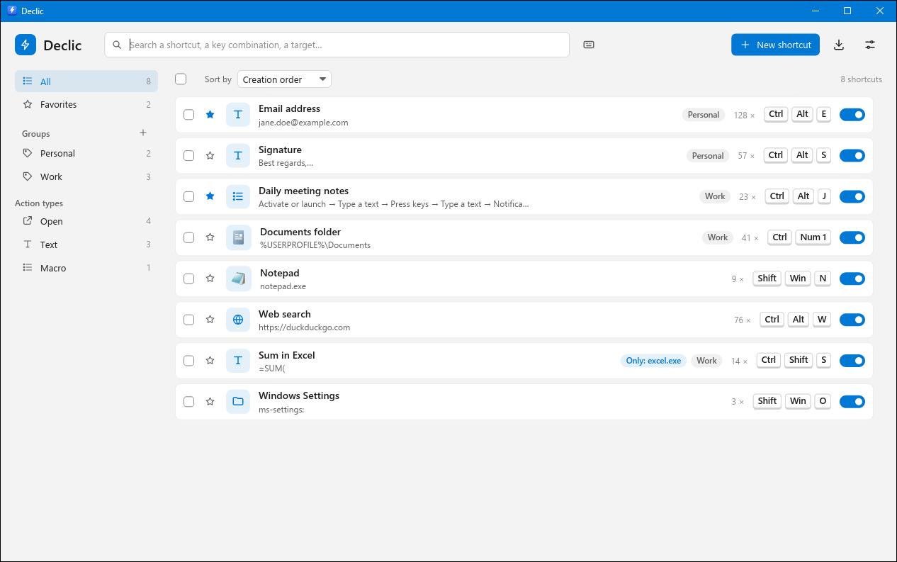
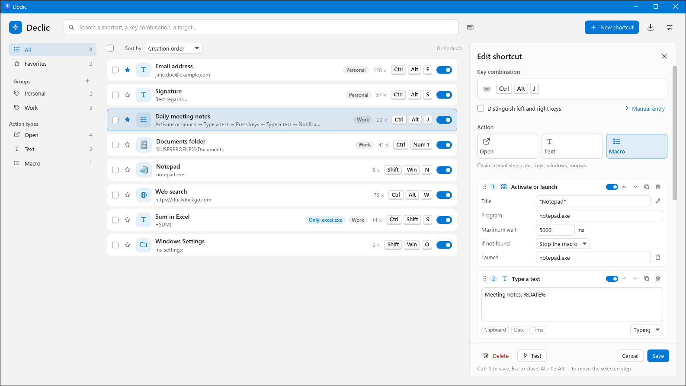

# Declic

**Your keyboard shortcuts, in a click.**

**English** · [Français](README.fr.md)



Declic is a keyboard-shortcut utility for Windows 10 and 11. It lets you bind
a **key combination** to an **action**:

- **Open** a program, a document, a folder, a website, a `mailto:` address or
  a Windows location (`ms-settings:…`);
- **Text**: type a text (email address, signature, formula…) into the active
  window, keystroke by keystroke or pasted;
- **Macro**: chain steps (text, key presses, waits, window activation, mouse
  clicks and moves, notifications…).

Declic runs quietly in the notification area (about 2 MB of private memory
at idle). It is written in Rust with the [iced](https://iced.rs) GUI toolkit
and is available in 31 languages (see [Languages](#languages)).

> This version is the **V1** described in § 13 of the functional
> specification
> ([`docs/functional-specification.md`](docs/functional-specification.md)):
> the MVP, plus macros, groups, import/export and quality-of-life features.

## Download

Get the latest version from the
**[Releases](https://github.com/florent3108/Declic/releases/latest)** page:
unzip it, then run `declic.exe`. No installation or administrator rights are
needed.

> The executable is not code-signed yet: on first launch, Windows may show
> "Windows protected your PC". Click **More info**, then **Run anyway**.



## Features

### Key combinations and conditions

- Any key (letters, digits, punctuation, F1–F24, numeric keypad separate from
  the top-row digits, media, browser and launch keys…), with the Ctrl, Alt,
  Shift and Win modifiers, and optional left/right distinction.
- Combinations are entered **by recording** (existing shortcuts and Windows
  combinations such as Win+E are suspended while recording; a lone Esc
  cancels) or **manually** (modifiers + a searchable key list).
- Conditions: *everywhere*, *only in…* or *everywhere except…* a list of
  programs (typed, picked from open programs, from **installed programs**
  with search and icons, by choosing an `.exe`, or with the **eyedropper**:
  click a window), and the state of Caps Lock / Num Lock / Scroll Lock (read
  at the time of the key press).
- The most specific shortcut wins (*only in* > *everywhere except* >
  *everywhere*); if no shortcut matches, the combination is passed on to the
  application as usual.
- Conflicts: detected while editing (with a link to the conflicting
  shortcut), a "Conflict" badge in the list, warnings for risky combinations
  or ones reserved by Windows, and an "Also used elsewhere" warning when
  another application (or Windows) has already registered the combination.
  Declic can still take it over.

### Actions

- *Open*: arguments, working folder, normal / minimized / maximized window,
  run as administrator; file or folder picker, drag-and-drop, installed
  programs list; shows the target of a `.lnk` shortcut.
- *Text*: full Unicode, multiple lines, two modes:
  - **typing**: the text is typed character by character;
  - **paste**: the text goes through the clipboard, then Ctrl+V; the previous
    clipboard content is **restored** afterwards (the temporary text is
    flagged so it doesn't show up in the Windows clipboard history).
  The default mode for new texts is set in the settings. A text can be
  **turned into a macro** in one click.
- *Macro*: visual block editor. The **+** button offers 13 step types:

  | Step | Settings |
  |---|---|
  | Type a text | text, typing or paste mode |
  | Press keys | combination (recorded or picked), number of repetitions |
  | Hold keys / Release keys | keys to keep pressed, then release (all by default) |
  | Wait | duration in milliseconds |
  | Activate a window | title with `*` and `?` wildcards, and/or program; timeout; if not found: stop or continue |
  | Activate or launch | same, plus a program to launch if the window doesn't exist |
  | Open | same as the *Open* action |
  | Copy to clipboard | text (variables allowed) |
  | Click | left / right / middle button; single, double, press, release |
  | Move the mouse | absolute screen position, relative to the active window or to the pointer |
  | Wheel | direction and number of notches |
  | Notification | message shown in a Windows notification |

  Each step can be **duplicated**, **deleted**, **disabled** (it stays in the
  list but isn't played) and **moved** by **drag-and-drop**: grab the ⋮⋮
  handle at the start of the card header (on the right in Arabic and Hebrew)
  and drop the step where the coloured line shows. The list scrolls by itself
  near the top or bottom of the editor; Esc, or releasing the button outside
  the steps area, cancels the move. Alternatively, especially from the
  keyboard: the card's ↑ / ↓ arrows, or Alt+↑ / Alt+↓ for the selected step,
  move it one position.
  Window and position fields have an **eyedropper**: click the window or the
  spot on the screen you want (right-click or Esc to cancel).
  Incomplete steps are flagged before saving.
- Variables in targets, arguments and texts: `%USERPROFILE%` (and any
  environment variable), `%CLIPBOARD%`, `%DATE%`, `%TIME%`, custom formats
  `%DATE:dd/MM/yyyy%`, `%TIME:HH:mm%`, and `%%` for a literal "%".
- **Test** button in the editor: after a 3-second countdown, the Declic
  window minimizes and the action is played in the previously active window
  (not counted in the statistics).

### Running macros

- **Stop key** (Esc by default, configurable in the settings): interrupts the
  running macro. Outside a macro, the key keeps its normal role.
- **Discreet indicator**: the notification-area icon changes while an action
  that lasts more than a quarter of a second is running.
- One action at a time. **If a shortcut is triggered while a macro is
  running, it is ignored** (and written to the log) rather than queued: this
  is the safest behaviour, since an accidental key press can't set off
  cascading actions. Keys sent by Declic itself never trigger a shortcut.
- Before playing a macro, Declic logically releases the modifiers the user is
  still holding; at the end (or when stopped), it releases the keys and mouse
  buttons the macro was holding.

### Main window

- Instant search (name, combination, target, text, steps, group), search by
  combination, filters by action type.
- **Groups** in a side panel: *All*, *Favorites* and your own groups (create,
  rename, delete — shortcuts of a deleted group are kept). The group and the
  "favorite" star are set in the editor or through multi-selection.
- **Sorting**: creation order, name, combination, type, number of uses, last
  use.
- **Statistics**: number of uses and date of last use for each shortcut;
  reset per shortcut, per selection or globally. Undoing a deletion keeps the
  shortcut's statistics.
- **Multi-selection** (checkboxes): enable, disable, duplicate, move to a
  group, export, reset statistics, delete.
- On/off switch, side-panel editor, undoable deletion. Unsaved changes in
  the editor are never lost without confirmation (switching shortcuts,
  settings, closing).
- Window keyboard shortcuts: Ctrl+N (new), Ctrl+S (save), Ctrl+F (search),
  Esc.

### Import, export

- **Export** all shortcuts or the selection to a TOML file (same format as
  the configuration).
- **Import** such a file: preview, then choose what to do with duplicates
  (same combination and same conditions as an existing shortcut):
  - *Merge*: both are kept, and the imported shortcut is added **disabled**
    to avoid any conflict;
  - *Replace*: the imported shortcut replaces the existing one;
  - *Ignore*: the duplicate is not imported.
  Groups of imported shortcuts are created as needed.
- **Export to CSV** (Windows list separator, UTF-8) and **copy as a table**
  (to paste into a spreadsheet or a document).

### Cheat sheet, global combinations, notifications

- **Cheat sheet**: a global combination (set in the settings) shows, on top of
  every window, the list of shortcuts active in the foreground program; a key
  press (which is then not passed to the application), a click in another
  window or the same combination closes it.
- **Open the Declic window** with a global combination (to be set).
- Notification area: open, pause all shortcuts (the icon changes), settings,
  quit.
- Non-blocking notifications (target not found, administrator window, macro
  interrupted…), which can be turned off in the settings; *Notification*
  steps in macros are always shown.

### Settings

Language (automatic or one of the 31 languages, see [Languages](#languages)),
theme (follow Windows, light, dark — with the Windows accent colour), start
with Windows (per user, no administrator rights), notifications, global
combinations, default text mode, delay between keystrokes, macro stop key,
access to the configuration folder and to the log.

## Building

Requirements: Windows 10/11 x64, stable [Rust](https://rustup.rs) (1.88 or
later) with the MSVC toolchain and the Visual Studio C++ build tools (for
`rc.exe`, used to embed the icon and the manifest).

```powershell
cargo build --release          # executable: target\release\declic.exe
cargo test                     # unit tests
cargo clippy --all-targets     # static analysis
```

A few tests that simulate keystrokes or print measurements are disabled by
default: `cargo test -p declic-win -- --ignored`.

## Usage

- `declic.exe`: starts Declic in the notification area and opens the main
  window (if Declic is already running, its window is simply shown).
- `declic.exe --background`: starts without opening the window (used when
  Windows starts).

Declic is made of a lightweight **service** (keyboard hook, icon, action
execution) that stays in memory, and of processes started on demand by the
same executable: the main window (`--ui`), the combination recorder
(`--capture`), the eyedropper (`--pick`) and the cheat sheet (`--overlay`).
Windows doesn't call a process's keyboard hook while that process's own
window has the focus: that's why the recorder and the eyedropper run in a
small windowless process.

## Where is the configuration?

- Standard location: `%APPDATA%\Declic\config.toml`
  (for example `C:\Users\<you>\AppData\Roaming\Declic\config.toml`).
- Portable mode: if a `config.toml` file sits next to `declic.exe`, that one
  is used (create a file containing `version = 2` to enable this mode).
- The file is readable TOML text that can be edited by hand; Declic reloads
  it automatically when it changes. It is saved on every change with an
  atomic write, and the 5 previous versions are kept (`config.toml.bak1` …
  `config.toml.bak5`).
- Usage statistics are in `stats.toml` and the event log in `declic.log`, in
  the same folder.
- Files from version 1 (MVP) are read without any manual conversion.

Example:

```toml
version = 2
groups = ["Work"]

[settings]
language = "auto"                  # "auto" or a code: "en", "fr", "de", "pt-BR"…
theme = "system"                   # "system", "light", "dark"
typing_delay_ms = 0
stop_key = "Escape"                # macro stop key
cheat_sheet_keys = "Ctrl+Alt+Shift+H"
open_window_keys = "Ctrl+Alt+Shift+D"

[[shortcut]]
id = 1
name = "Email address"
keys = "Ctrl+Alt+M"
action = { type = "macro", steps = [{ step = "type_text", text = "first.last@example.com" }] }

[[shortcut]]
id = 2
name = "Projects folder"
group = "Work"
keys = "Ctrl+Num1"
action = { type = "open", target = '%USERPROFILE%\Projects' }
conditions = { program_mode = "except", programs = ["excel.exe"] }

[[shortcut]]
id = 3
name = "Meeting notes"
group = "Work"
favorite = true
keys = "Ctrl+Alt+R"
[shortcut.action]
type = "macro"
[[shortcut.action.steps]]
step = "activate_or_launch"
title = "*Notepad*"
program = "notepad.exe"
launch = { target = "notepad.exe" }
[[shortcut.action.steps]]
step = "type_text"
text = "Meeting notes, %DATE%"
mode = "paste"
[[shortcut.action.steps]]
step = "press_keys"
keys = "Enter"
repeat = 2
[[shortcut.action.steps]]
step = "wait"
ms = 500
enabled = false                    # disabled step
[[shortcut.action.steps]]
step = "notify"
text = "Notes ready"
```

Key names don't depend on the keyboard layout (`Ctrl+Alt+M`, `Win+N`,
`Ctrl+Num1`, `RightCtrl+P`, `MediaPlayPause`, `LaunchApp2`, `Oem1`…). A
*Text* action is a macro with a single "Type a text" step.

Step types (`step = …`): `type_text`, `press_keys`, `hold_keys`,
`release_keys`, `wait`, `activate_window`, `activate_or_launch`, `open`,
`copy_text`, `click`, `move_mouse`, `wheel`, `notify`.

## Languages

Declic is available in 31 languages, all built into the executable:

| Language | Code | Language | Code | Language | Code |
|---|---|---|---|---|---|
| Bahasa Indonesia | `id` | Nederlands | `nl` | Ελληνικά | `el` |
| Čeština | `cs` | Norsk bokmål | `nb` | Русский | `ru` |
| Dansk | `da` | Polski | `pl` | Українська | `uk` |
| Deutsch | `de` | Português (Brasil) | `pt-BR` | עברית | `he` |
| English | `en` | Português (Portugal) | `pt-PT` | العربية | `ar` |
| Español | `es` | Română | `ro` | हिन्दी | `hi` |
| Français | `fr` | Slovenčina | `sk` | ไทย | `th` |
| Italiano | `it` | Suomi | `fi` | 中文（简体） | `zh-CN` |
| Magyar | `hu` | Svenska | `sv` | 中文（繁體） | `zh-TW` |
| | | Tiếng Việt | `vi` | 日本語 | `ja` |
| | | Türkçe | `tr` | 한국어 | `ko` |

> **Machine-assisted translations.** French (the original language) and
> English are written by hand; the other 29 languages were translated
> automatically from these two texts, following the usual Windows terminology
> (for example "Strg" and "Tastenkombination" in German). They may contain
> awkward phrasing: reviews and corrections by native speakers are very
> welcome.

| Japanese | Arabic (right-to-left interface) |
|---|---|
|  |  |

- **Automatic choice**: in "Automatic" mode, Declic follows the Windows
  display language (`pt-PT` and `pt-BR` are distinct; `zh-Hans`, `zh-SG` →
  Simplified Chinese; `zh-Hant`, `zh-HK`, `zh-MO` → Traditional Chinese;
  Norwegian `no`/`nn` → Bokmål; otherwise the base language, for example
  `de-AT` → German), then English.
- **Plurals**: each language uses the CLDR categories it needs
  (`one`/`few`/`many` in Russian or Polish, all six categories in Arabic, no
  distinction in Japanese…).
- **Keys**: keys carry their usual name in each language ("Strg", "Entf",
  "Pos1" in German, "Maj", "Suppr" in French…).
- **Dates and numbers**: if the Windows regional format is in the same
  language as the interface, it is used as is (with your customisations);
  otherwise Declic uses the usual formats of the interface language
  (`format.locale` in the language file). The CSV separator always follows
  your regional settings, so that your spreadsheet opens the files correctly.
- **Fonts**: each language names the suitable Windows UI font
  (`language.font`, for example Yu Gothic UI for Japanese, Microsoft YaHei UI
  / JhengHei UI for Chinese, Malgun Gothic for Korean, Leelawadee UI for
  Thai, Nirmala UI for Hindi); missing characters are drawn with the other
  Windows fonts. The font is chosen when the window opens: after a language
  change, it applies the next time the window is opened.
- **Arabic and Hebrew**: text is shaped and displayed right to left, and the
  window layout is mirrored (side panel on the right, editor on the left,
  mirrored row items, right-to-left notification-area menu). Key
  combinations stay written left to right ("Ctrl + Alt + M"). Limitations:
  scrollbars stay on the right, icons (arrows, chevrons) are not flipped, and
  input fields left-align their content.

### Fixing or adding a translation

Texts live in `lang/<code>.toml`, one TOML file per language (`en.toml` is the
reference and the fallback for missing keys).

- **Without rebuilding**: put a `<code>.toml` file in a `lang` folder next to
  `declic.exe`. For a built-in language, it only overrides the texts it
  contains (you can include just your fixes); for a new language, copy
  `en.toml` under the desired name (for example `ca.toml`), translate it, and
  the language shows up in the settings.
- **In the repository**: edit `lang/<code>.toml` (or add the file and its
  code in `crates/declic/src/tr.rs`), then run `cargo test`: a test checks
  that every file has exactly the keys and `{placeholders}` of `en.toml`, the
  plural forms the language requires, complete month and day names, and a
  `format.locale` recognised by Windows.
- Keep the `{placeholders}`, the `%DATE:…%` syntax and the sample file names
  as they are; in `[language]`, give the language's name in its own script
  (`name`), the font (`font`) and the writing direction (`direction = "rtl"`
  for a right-to-left language).

## Architecture

A Cargo workspace with three crates:

- `crates/declic-core`: platform-independent, fully tested core (data model,
  macro steps, configuration format and atomic writes, resolving a key press
  to a shortcut, conflicts, variables, translations, search, statistics,
  import/export/CSV, layout-independent key model, step reordering);
- `crates/declic-win`: Windows layer (low-level keyboard and mouse hooks,
  injection of keys, Unicode text and mouse events with `SendInput`,
  clipboard, finding and activating windows, opening through the shell,
  installed programs and their icons, detection of already-registered
  combinations, notification area, notification balloons, autostart, file
  pickers, configuration folder watching);
- `crates/declic`: the executable (background service and macro runner, iced
  window, recorder and eyedropper helpers, cheat sheet, icons drawn in code).

## Known limitations

- The installed-programs list is built from the Start menu: Microsoft Store
  (UWP) apps are not included.
- The "already used elsewhere" detection only sees combinations registered
  with `RegisterHotKey` (most applications and Windows itself); it can't tell
  which program uses them.
- Windows prevents a normal application from sending keys or clicks to a
  window running as administrator: Declic reports it with a notification.
- Keycaps follow the active keyboard layout for punctuation keys; other keys
  have translated names.
- Accessibility (screen readers) depends on iced's support, which is still
  limited.

## License

Declic is distributed, **at your option**, under either of:

- the Apache License, Version 2.0 ([`LICENSE-APACHE`](LICENSE-APACHE) or
  <https://www.apache.org/licenses/LICENSE-2.0>);
- the MIT license ([`LICENSE-MIT`](LICENSE-MIT) or
  <https://opensource.org/licenses/MIT>).

### Contributions

Unless you explicitly state otherwise, any contribution intentionally
submitted for inclusion in Declic by you, as defined in the Apache-2.0
license, shall be dual-licensed as above (MIT or Apache 2.0, at your option),
without any additional terms or conditions.

### Third-party components

- All dependencies use permissive licenses; their texts are gathered in
  [`THIRD-PARTY-LICENSES.txt`](THIRD-PARTY-LICENSES.txt), generated with
  [cargo-about](https://github.com/EmbarkStudios/cargo-about):
  `cargo about generate about.hbs -o THIRD-PARTY-LICENSES.txt --locked`.
- Declic is an independent clean-room implementation, written only from its
  own functional specification (see § 0 of
  [`docs/functional-specification.md`](docs/functional-specification.md)).
